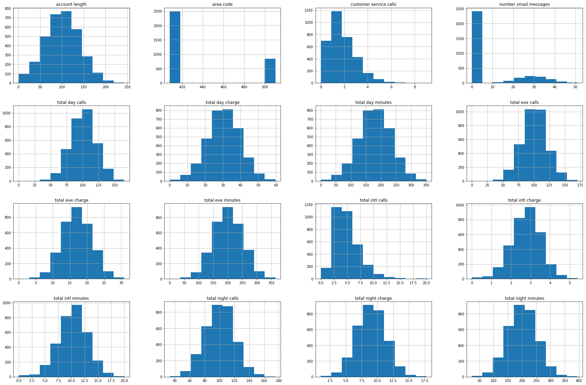
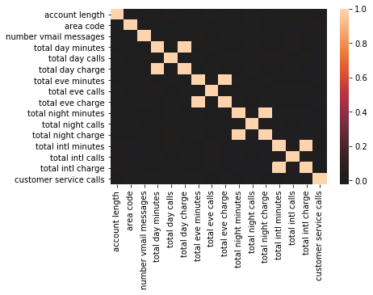
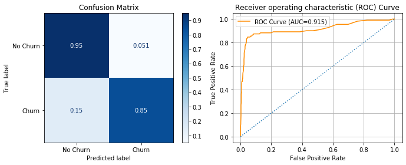
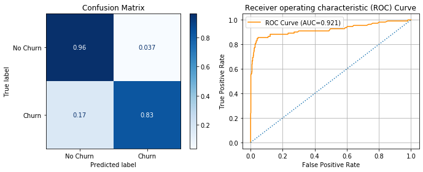
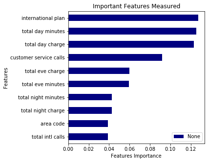
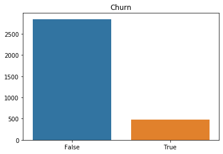
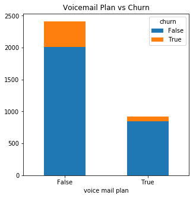
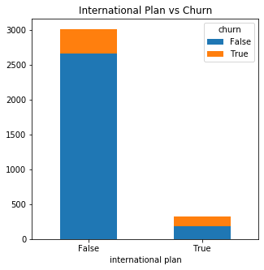

## Final Project Submission

Please fill out:
* Student name: Susanna Han
* Student pace: part time
* Scheduled project review date/time: 05/08/2020
* Instructor name: James Irving
* Blog post URL: https://medium.com/@susanna.jihae.han/project-mod-3-vesi-edf9a4387da4


# Introduction

A classifier model is used to predict whether a customer will ("soon") stop doing business with SyriaTel, a telecommunications company. There are a total of 21 different features including the target variable, churn. Churn provides the information of whether or not a customer has stopped doing business with the company. 

A random forest algorithm will be used to categorize all the features to predict the target variable. The feature importance will tell us how many times a feature is used to decide whether or not a customer is more likley to churn. The 21 features in this dataset are listed below:

- state  
- account length
- area code 
- phone number
- international plan
- voicemail plan
- number vmail messages
- customer service calls
- total intl minutes/calls/charge
- total day minutes/calls/charge
- total eve minutes/calls/charge
- total night minutes/calls/charge
- churn (target variable)

RandomizedSearchCV is an algorithm used to find the best combination of parameters in the model to increase the accuracy of the random forest method in making predictions.

All the imports and functions used in this project are imported below: 


```python
!pip install -U fsds_100719
from fsds_100719.imports import *
import warnings
warnings.filterwarnings('ignore')

import pandas as pd
import numpy as np
import matplotlib.pyplot as plt
%matplotlib inline
%conda update scikit-learn
from sklearn.model_selection import train_test_split, RandomizedSearchCV
from sklearn.ensemble import RandomForestClassifier
from sklearn import metrics
from sklearn.metrics import accuracy_score
from sklearn.tree import export_graphviz
from IPython.display import Image  
from imblearn.over_sampling import SMOTE

```

    fsds_1007219  v0.7.21 loaded.  Read the docs: https://fsds.readthedocs.io/en/latest/ 


<style  type="text/css" >
</style><table id="T_57225cc8_956c_11ea_86da_784f439268e3" ><caption>Loaded Packages and Handles</caption><thead>    <tr>        <th class="col_heading level0 col0" >Handle</th>        <th class="col_heading level0 col1" >Package</th>        <th class="col_heading level0 col2" >Description</th>    </tr></thead><tbody>
                <tr>
                                <td id="T_57225cc8_956c_11ea_86da_784f439268e3row0_col0" class="data row0 col0" >dp</td>
                        <td id="T_57225cc8_956c_11ea_86da_784f439268e3row0_col1" class="data row0 col1" >IPython.display</td>
                        <td id="T_57225cc8_956c_11ea_86da_784f439268e3row0_col2" class="data row0 col2" >Display modules with helpful display and clearing commands.</td>
            </tr>
            <tr>
                                <td id="T_57225cc8_956c_11ea_86da_784f439268e3row1_col0" class="data row1 col0" >fs</td>
                        <td id="T_57225cc8_956c_11ea_86da_784f439268e3row1_col1" class="data row1 col1" >fsds_100719</td>
                        <td id="T_57225cc8_956c_11ea_86da_784f439268e3row1_col2" class="data row1 col2" >Custom data science bootcamp student package</td>
            </tr>
            <tr>
                                <td id="T_57225cc8_956c_11ea_86da_784f439268e3row2_col0" class="data row2 col0" >mpl</td>
                        <td id="T_57225cc8_956c_11ea_86da_784f439268e3row2_col1" class="data row2 col1" >matplotlib</td>
                        <td id="T_57225cc8_956c_11ea_86da_784f439268e3row2_col2" class="data row2 col2" >Matplotlib's base OOP module with formatting artists</td>
            </tr>
            <tr>
                                <td id="T_57225cc8_956c_11ea_86da_784f439268e3row3_col0" class="data row3 col0" >plt</td>
                        <td id="T_57225cc8_956c_11ea_86da_784f439268e3row3_col1" class="data row3 col1" >matplotlib.pyplot</td>
                        <td id="T_57225cc8_956c_11ea_86da_784f439268e3row3_col2" class="data row3 col2" >Matplotlib's matlab-like plotting module</td>
            </tr>
            <tr>
                                <td id="T_57225cc8_956c_11ea_86da_784f439268e3row4_col0" class="data row4 col0" >np</td>
                        <td id="T_57225cc8_956c_11ea_86da_784f439268e3row4_col1" class="data row4 col1" >numpy</td>
                        <td id="T_57225cc8_956c_11ea_86da_784f439268e3row4_col2" class="data row4 col2" >scientific computing with Python</td>
            </tr>
            <tr>
                                <td id="T_57225cc8_956c_11ea_86da_784f439268e3row5_col0" class="data row5 col0" >pd</td>
                        <td id="T_57225cc8_956c_11ea_86da_784f439268e3row5_col1" class="data row5 col1" >pandas</td>
                        <td id="T_57225cc8_956c_11ea_86da_784f439268e3row5_col2" class="data row5 col2" >High performance data structures and tools</td>
            </tr>
            <tr>
                                <td id="T_57225cc8_956c_11ea_86da_784f439268e3row6_col0" class="data row6 col0" >sns</td>
                        <td id="T_57225cc8_956c_11ea_86da_784f439268e3row6_col1" class="data row6 col1" >seaborn</td>
                        <td id="T_57225cc8_956c_11ea_86da_784f439268e3row6_col2" class="data row6 col2" >High-level data visualization library based on matplotlib</td>
            </tr>
    </tbody></table>


<script type="text/javascript">
window.PlotlyConfig = {MathJaxConfig: 'local'};
if (window.MathJax) {MathJax.Hub.Config({SVG: {font: "STIX-Web"}});}
if (typeof require !== 'undefined') {
require.undef("plotly");
requirejs.config({
    paths: {
        'plotly': ['https://cdn.plot.ly/plotly-latest.min']
    }
});
require(['plotly'], function(Plotly) {
    window._Plotly = Plotly;
});
}
</script>


    [i] Pandas .iplot() method activated.
    Collecting package metadata (current_repodata.json): done
    Solving environment: done
    
    # All requested packages already installed.
    
    
    Note: you may need to restart the kernel to use updated packages.


    Using TensorFlow backend.


```python
def plot_importance(tree_clf, top_n=10,figsize=(5,5)):
    """ Arguments needed to plot an importance bar graph is the model, number of features to display, and 
    desired figsize for the graph. 
    
    This function displays a bar graph of top 10 important features from most to least important."""
    
    #calculates which feature was used the most in the model.
    df_importance = pd.Series(tree_clf.feature_importances_,index=X_train.columns)
    #sorts 10 important features data in ascending order
    df_importance.sort_values(ascending=True).tail(top_n).plot(
        kind='barh', cmap = 'jet', figsize=figsize)
    
    #graph labels
    plt.xlabel('Features Importance')
    plt.ylabel('Features')
    plt.title('Important Features Measured')
    plt.legend()
    plt.show() 

    return df_importance
```


```python
def evaluate_model(y_true, y_pred,X_true,clf, display_labels=('No Churn', 'Churn')):
    """
    Arguments needed to evaluate the model are y_true(train data), y_pred (test data), x_true (train data), 
    the model, and display labels.
    
    Evaluate_model prints out the precision, recall, and f1-score score. As well as accuracy, 
    macro average, and weighted average.
    
    On the left, a Confusion Matrix visual shows the percentage of how accurate the model fit both true and false
    values. On the right, is a graph of the ROC curve compared to the base line. Showing the percentage or AUC.
    
    Below is a plot_importance bar graph.

    """
    ## Classification Report / Scores 
    print(metrics.classification_report(y_true,y_pred))
    # plots Confusion Matrix
    fig, ax = plt.subplots(figsize=(10,4),ncols=2)
    metrics.plot_confusion_matrix(clf,X_true,y_true,cmap="Blues",
                                  normalize='true',ax=ax[0], display_labels = display_labels)
    ax[0].set(title='Confusion Matrix')
    y_score = clf.predict_proba(X_true)[:,1]
    # plots ROC curve graph
    fpr,tpr,thresh = metrics.roc_curve(y_true,y_score)
    
    # labels and color scheme
    roc_auc = round(metrics.auc(fpr,tpr),3)
    ax[1].plot(fpr,tpr,color='darkorange',label=f'ROC Curve (AUC={roc_auc})')
    ax[1].plot([0,1],[0,1],ls=':')
    ax[1].legend()
    ax[1].grid()
    ax[1].set(ylabel='True Positive Rate',xlabel='False Positive Rate',
          title='Receiver operating characteristic (ROC) Curve')
    plt.tight_layout()
    plt.show()
    #includes plot_importance graph
    try: 
        df_important = plot_importance(clf)
    except:
        df_important = None
        
```


```python
import tzlocal
import datetime as dt
tz = tzlocal.get_localzone()
print(tz)
start = dt.datetime.now(tz)
print(start.strftime("%m/%d/%Y - %I:%M %p"))
print(dt.datetime.now(tz))
```

    America/Los_Angeles
    05/13/2020 - 03:52 PM
    2020-05-13 15:52:09.782816-07:00


```python
## a timer to record how long a process takes
class Timer():
 
    ## imports local time and formats displayed time
    def __init__(self,format_="%m/%d/%y - %I:%M %p"):
        import tzlocal
        self.tz = tzlocal.get_localzone()
        self.fmt = format_
        self.created_at = self.get_time()
        
    ## returns current time.
    def get_time(self):
        import datetime as dt
        return dt.datetime.now(self.tz)

    ## displays when time has started.
    def start(self):
        time = self.get_time()
        self.start = time
        print(f"[i] Timer started at{self.start.strftime(self.fmt)}")
        

    ## displays when time has stopped.
    def stop(self):
        time = self.get_time()
        self.end = time
        print(f"[i] Timer ended at {self.end.strftime(self.fmt)}")
        print(f"- Total time = {self.end-self.start}")
timer = Timer()
print(timer.created_at)
```

    2020-05-13 15:52:09.791764-07:00


# Pre-Processing

First I pull in my dataset and explore the data I have to use to build my models.


```python
df = pd.read_csv('telecom_churns.csv')
df.head()
```


<div>
<style scoped>
    .dataframe tbody tr th:only-of-type {
        vertical-align: middle;
    }

    .dataframe tbody tr th {
        vertical-align: top;
    }

    .dataframe thead th {
        text-align: right;
    }
</style>
<table border="1" class="dataframe">
  <thead>
    <tr style="text-align: right;">
      <th></th>
      <th>state</th>
      <th>account length</th>
      <th>area code</th>
      <th>phone number</th>
      <th>international plan</th>
      <th>voice mail plan</th>
      <th>number vmail messages</th>
      <th>total day minutes</th>
      <th>total day calls</th>
      <th>total day charge</th>
      <th>...</th>
      <th>total eve calls</th>
      <th>total eve charge</th>
      <th>total night minutes</th>
      <th>total night calls</th>
      <th>total night charge</th>
      <th>total intl minutes</th>
      <th>total intl calls</th>
      <th>total intl charge</th>
      <th>customer service calls</th>
      <th>churn</th>
    </tr>
  </thead>
  <tbody>
    <tr>
      <th>0</th>
      <td>KS</td>
      <td>128</td>
      <td>415</td>
      <td>382-4657</td>
      <td>no</td>
      <td>yes</td>
      <td>25</td>
      <td>265.1</td>
      <td>110</td>
      <td>45.07</td>
      <td>...</td>
      <td>99</td>
      <td>16.78</td>
      <td>244.7</td>
      <td>91</td>
      <td>11.01</td>
      <td>10.0</td>
      <td>3</td>
      <td>2.70</td>
      <td>1</td>
      <td>False</td>
    </tr>
    <tr>
      <th>1</th>
      <td>OH</td>
      <td>107</td>
      <td>415</td>
      <td>371-7191</td>
      <td>no</td>
      <td>yes</td>
      <td>26</td>
      <td>161.6</td>
      <td>123</td>
      <td>27.47</td>
      <td>...</td>
      <td>103</td>
      <td>16.62</td>
      <td>254.4</td>
      <td>103</td>
      <td>11.45</td>
      <td>13.7</td>
      <td>3</td>
      <td>3.70</td>
      <td>1</td>
      <td>False</td>
    </tr>
    <tr>
      <th>2</th>
      <td>NJ</td>
      <td>137</td>
      <td>415</td>
      <td>358-1921</td>
      <td>no</td>
      <td>no</td>
      <td>0</td>
      <td>243.4</td>
      <td>114</td>
      <td>41.38</td>
      <td>...</td>
      <td>110</td>
      <td>10.30</td>
      <td>162.6</td>
      <td>104</td>
      <td>7.32</td>
      <td>12.2</td>
      <td>5</td>
      <td>3.29</td>
      <td>0</td>
      <td>False</td>
    </tr>
    <tr>
      <th>3</th>
      <td>OH</td>
      <td>84</td>
      <td>408</td>
      <td>375-9999</td>
      <td>yes</td>
      <td>no</td>
      <td>0</td>
      <td>299.4</td>
      <td>71</td>
      <td>50.90</td>
      <td>...</td>
      <td>88</td>
      <td>5.26</td>
      <td>196.9</td>
      <td>89</td>
      <td>8.86</td>
      <td>6.6</td>
      <td>7</td>
      <td>1.78</td>
      <td>2</td>
      <td>False</td>
    </tr>
    <tr>
      <th>4</th>
      <td>OK</td>
      <td>75</td>
      <td>415</td>
      <td>330-6626</td>
      <td>yes</td>
      <td>no</td>
      <td>0</td>
      <td>166.7</td>
      <td>113</td>
      <td>28.34</td>
      <td>...</td>
      <td>122</td>
      <td>12.61</td>
      <td>186.9</td>
      <td>121</td>
      <td>8.41</td>
      <td>10.1</td>
      <td>3</td>
      <td>2.73</td>
      <td>3</td>
      <td>False</td>
    </tr>
  </tbody>
</table>
<p>5 rows × 21 columns</p>
</div>


```python
df.info()
```

    <class 'pandas.core.frame.DataFrame'>
    RangeIndex: 3333 entries, 0 to 3332
    Data columns (total 21 columns):
     #   Column                  Non-Null Count  Dtype  
    ---  ------                  --------------  -----  
     0   state                   3333 non-null   object 
     1   account length          3333 non-null   int64  
     2   area code               3333 non-null   int64  
     3   phone number            3333 non-null   object 
     4   international plan      3333 non-null   object 
     5   voice mail plan         3333 non-null   object 
     6   number vmail messages   3333 non-null   int64  
     7   total day minutes       3333 non-null   float64
     8   total day calls         3333 non-null   int64  
     9   total day charge        3333 non-null   float64
     10  total eve minutes       3333 non-null   float64
     11  total eve calls         3333 non-null   int64  
     12  total eve charge        3333 non-null   float64
     13  total night minutes     3333 non-null   float64
     14  total night calls       3333 non-null   int64  
     15  total night charge      3333 non-null   float64
     16  total intl minutes      3333 non-null   float64
     17  total intl calls        3333 non-null   int64  
     18  total intl charge       3333 non-null   float64
     19  customer service calls  3333 non-null   int64  
     20  churn                   3333 non-null   bool   
    dtypes: bool(1), float64(8), int64(8), object(4)
    memory usage: 524.2+ KB


Through .info() we are able to gather the following information. 
- The dataset has 3333 rows and 21 columns. 
- The names of all the columns.
- There are no missing values in the data set.
- 1 bool (target) column.
- 16 float/int columns. 
- 4 object (categorical) columns. 


```python
pd.DataFrame(df.isna().sum())
#There are no null values in the data set!
```


<div>
<style scoped>
    .dataframe tbody tr th:only-of-type {
        vertical-align: middle;
    }

    .dataframe tbody tr th {
        vertical-align: top;
    }

    .dataframe thead th {
        text-align: right;
    }
</style>
<table border="1" class="dataframe">
  <thead>
    <tr style="text-align: right;">
      <th></th>
      <th>0</th>
    </tr>
  </thead>
  <tbody>
    <tr>
      <th>state</th>
      <td>0</td>
    </tr>
    <tr>
      <th>account length</th>
      <td>0</td>
    </tr>
    <tr>
      <th>area code</th>
      <td>0</td>
    </tr>
    <tr>
      <th>phone number</th>
      <td>0</td>
    </tr>
    <tr>
      <th>international plan</th>
      <td>0</td>
    </tr>
    <tr>
      <th>voice mail plan</th>
      <td>0</td>
    </tr>
    <tr>
      <th>number vmail messages</th>
      <td>0</td>
    </tr>
    <tr>
      <th>total day minutes</th>
      <td>0</td>
    </tr>
    <tr>
      <th>total day calls</th>
      <td>0</td>
    </tr>
    <tr>
      <th>total day charge</th>
      <td>0</td>
    </tr>
    <tr>
      <th>total eve minutes</th>
      <td>0</td>
    </tr>
    <tr>
      <th>total eve calls</th>
      <td>0</td>
    </tr>
    <tr>
      <th>total eve charge</th>
      <td>0</td>
    </tr>
    <tr>
      <th>total night minutes</th>
      <td>0</td>
    </tr>
    <tr>
      <th>total night calls</th>
      <td>0</td>
    </tr>
    <tr>
      <th>total night charge</th>
      <td>0</td>
    </tr>
    <tr>
      <th>total intl minutes</th>
      <td>0</td>
    </tr>
    <tr>
      <th>total intl calls</th>
      <td>0</td>
    </tr>
    <tr>
      <th>total intl charge</th>
      <td>0</td>
    </tr>
    <tr>
      <th>customer service calls</th>
      <td>0</td>
    </tr>
    <tr>
      <th>churn</th>
      <td>0</td>
    </tr>
  </tbody>
</table>
</div>


After gathering the basic information of the dataset, pre-processing begins. Deciding which columns are important and converting the object data types to fit a model. 


```python
df['phone number'].value_counts().sum()
# Every phone number in our data set is a different number.
```


    3333


```python
df = df.drop(columns = ['phone number','state'])
#drop phone number - does not provide any new information; drop state - area code shares similar information
```


```python
d = {'yes': True, 'no': False}
df['international plan'] = df['international plan'].map(d)
# convert international plan from string to boolean.
```


```python
d2 = {'yes': True, 'no': False}
df['voice mail plan'] = df['voice mail plan'].map(d2)
# convert voice mail plan from string to boolean.
```


```python
df.info()
```

    <class 'pandas.core.frame.DataFrame'>
    RangeIndex: 3333 entries, 0 to 3332
    Data columns (total 19 columns):
     #   Column                  Non-Null Count  Dtype  
    ---  ------                  --------------  -----  
     0   account length          3333 non-null   int64  
     1   area code               3333 non-null   int64  
     2   international plan      3333 non-null   bool   
     3   voice mail plan         3333 non-null   bool   
     4   number vmail messages   3333 non-null   int64  
     5   total day minutes       3333 non-null   float64
     6   total day calls         3333 non-null   int64  
     7   total day charge        3333 non-null   float64
     8   total eve minutes       3333 non-null   float64
     9   total eve calls         3333 non-null   int64  
     10  total eve charge        3333 non-null   float64
     11  total night minutes     3333 non-null   float64
     12  total night calls       3333 non-null   int64  
     13  total night charge      3333 non-null   float64
     14  total intl minutes      3333 non-null   float64
     15  total intl calls        3333 non-null   int64  
     16  total intl charge       3333 non-null   float64
     17  customer service calls  3333 non-null   int64  
     18  churn                   3333 non-null   bool   
    dtypes: bool(3), float64(8), int64(8)
    memory usage: 426.5 KB


```python
bool_drop = df.drop(columns = ['international plan','voice mail plan'])
feat = bool_drop.loc[:, 'account length':'customer service calls']
feat.hist(figsize=(30,20));
```





All of the variables in our dataset has an equal distribution shown in the histagrams above. The column, number vmail messages, shows that many people do not have a vmail setup. Therefore it is represented as a spike at zero in the graph. This is not a sign of abnormal distribution. Below is a heat map visualization in which shows a matrix of all variables and correlation with one another.


```python
import seaborn as sns
sns.heatmap(feat.corr(), center=0);
```





```python
df.info()
#double checking dataframe after pre-processing.
```

    <class 'pandas.core.frame.DataFrame'>
    RangeIndex: 3333 entries, 0 to 3332
    Data columns (total 19 columns):
     #   Column                  Non-Null Count  Dtype  
    ---  ------                  --------------  -----  
     0   account length          3333 non-null   int64  
     1   area code               3333 non-null   int64  
     2   international plan      3333 non-null   bool   
     3   voice mail plan         3333 non-null   bool   
     4   number vmail messages   3333 non-null   int64  
     5   total day minutes       3333 non-null   float64
     6   total day calls         3333 non-null   int64  
     7   total day charge        3333 non-null   float64
     8   total eve minutes       3333 non-null   float64
     9   total eve calls         3333 non-null   int64  
     10  total eve charge        3333 non-null   float64
     11  total night minutes     3333 non-null   float64
     12  total night calls       3333 non-null   int64  
     13  total night charge      3333 non-null   float64
     14  total intl minutes      3333 non-null   float64
     15  total intl calls        3333 non-null   int64  
     16  total intl charge       3333 non-null   float64
     17  customer service calls  3333 non-null   int64  
     18  churn                   3333 non-null   bool   
    dtypes: bool(3), float64(8), int64(8)
    memory usage: 426.5 KB


# RF Model 1 (base_model)

The target is the variable that is being predicted and x is the remaining variables influencing the outcome. The train and test data are then split to fit the model(s). To ensure the model ahs equal amount of training. The train dataset is balanced to be 50% True and 50% False. 


```python
y = df['churn']
X = df.drop('churn', axis=1)
```


```python
X_train, X_test, y_train, y_test = train_test_split(X, y, test_size = .25, random_state = 123)
```


```python
y_train.value_counts(normalize=True)
#shows how inbalanced the dataset is.
```


    False    0.85114
    True     0.14886
    Name: churn, dtype: float64


```python
smote = SMOTE()
X_train, y_train = smote.fit_sample(X_train, y_train)
#balancing the train dataset to train the machine more equally.
```


```python
pd.Series(y_train).value_counts(normalize=True)
#verifying the equalized dataset.
```


    True     0.5
    False    0.5
    Name: churn, dtype: float64


Now that the dataset has been processed and equally distributed we fit the clean data through our first random forest algorithm model with no altered parameters.


```python
timer = Timer()
timer.start()

base_tree = RandomForestClassifier()
base_tree.fit(X_train, y_train)
timer.stop()
```

    [i] Timer started at05/13/20 - 03:52 PM
    [i] Timer ended at 05/13/20 - 03:52 PM
    - Total time = 0:00:00.910336


```python
y_hat_test = base_tree.predict(X_test)
#predictions
evaluate_model(y_test, y_hat_test, X_test, base_tree)
```

                  precision    recall  f1-score   support
    
           False       0.98      0.95      0.96       723
            True       0.72      0.85      0.78       111
    
        accuracy                           0.94       834
       macro avg       0.85      0.90      0.87       834
    weighted avg       0.94      0.94      0.94       834
    





```python
df_import = pd.Series(base_tree.feature_importances_, index = X_train.columns,name='Importance')
display(df_import.sort_values(ascending=True).tail())
```


    total eve minutes         0.055009
    customer service calls    0.099462
    total day minutes         0.131052
    international plan        0.143151
    total day charge          0.143988
    Name: Importance, dtype: float64


```python
display(base_tree.score(X_test, y_test))
display(base_tree.score(X_train, y_train))
```


    0.935251798561151


    1.0


We are able to see the top 5 important features shown above. The base model has an accuracy average of 94% and AUC score of 91%.

# RF- model 2 (best_tree)

Now that a base model was created, RandomizedSearchCV is used to compare different parameters of every combination listed below to tune the model.


```python
rf_random = RandomForestClassifier()
# Number of trees in random forest
n_estimators = [int(x) for x in np.linspace(start = 200, stop = 2000, num = 10)]
# Number of features to consider at every split
max_features = ['auto', 'sqrt']
# Maximum number of levels in tree
max_depth = [int(x) for x in np.linspace(10, 110, num = 11)]
max_depth.append(None)
# Minimum number of samples required to split a node
min_samples_split = [2, 5, 10]
# Minimum number of samples required at each leaf node
min_samples_leaf = [1, 2, 4]
# Method of selecting samples for training each tree
bootstrap = [True, False]
# Create the random grid
random_grid = {'n_estimators': n_estimators,
               'max_features': max_features,
               'max_depth': max_depth,
               'min_samples_split': min_samples_split,
               'min_samples_leaf': min_samples_leaf,
               'bootstrap': bootstrap,
               'criterion': ['gini','entropy']}
```


```python
# Random grid is used to search for best hyperparameters
# search across 100 different combinations, and use all available cores
timer = Timer()
timer.start()

rf_tree = RandomizedSearchCV(estimator = rf_random, 
                             param_distributions = random_grid, 
                             n_iter = 100,cv = 3, verbose=2, 
                             random_state=42, n_jobs = -1)
#Fitting 3 folds for each of 100 candidates, totalling 300 fits
# Fit the random search model
rf_tree.fit(X_train, y_train)
timer.stop()
```

    [i] Timer started at05/13/20 - 03:52 PM
    Fitting 3 folds for each of 100 candidates, totalling 300 fits


    [Parallel(n_jobs=-1)]: Using backend LokyBackend with 4 concurrent workers.
    [Parallel(n_jobs=-1)]: Done  33 tasks      | elapsed:  2.4min
    [Parallel(n_jobs=-1)]: Done 154 tasks      | elapsed: 10.8min
    [Parallel(n_jobs=-1)]: Done 300 out of 300 | elapsed: 20.2min finished


    [i] Timer ended at 05/13/20 - 04:12 PM
    - Total time = 0:20:25.547066


```python
display(rf_tree.best_params_)
```


    {'n_estimators': 1000,
     'min_samples_split': 2,
     'min_samples_leaf': 1,
     'max_features': 'auto',
     'max_depth': None,
     'criterion': 'entropy',
     'bootstrap': False}


```python
best_tree = rf_tree.best_estimator_
#tree with best params
y_hat_test = best_tree.predict(X_test)
#predictions
```


```python
evaluate_model(y_test, y_hat_test, X_test, best_tree)
```

                  precision    recall  f1-score   support
    
           False       0.97      0.96      0.97       723
            True       0.77      0.83      0.80       111
    
        accuracy                           0.94       834
       macro avg       0.87      0.90      0.88       834
    weighted avg       0.95      0.94      0.95       834
    








```python
df_import = pd.Series(best_tree.feature_importances_, index = X_train.columns,name='Importance')
display(df_import.sort_values(ascending=True))
```


    voice mail plan           0.014382
    total eve calls           0.028264
    total night calls         0.030906
    total day calls           0.031941
    number vmail messages     0.033574
    account length            0.037162
    total intl minutes        0.037223
    total intl charge         0.037226
    total intl calls          0.038709
    area code                 0.038977
    total night charge        0.042451
    total night minutes       0.042509
    total eve minutes         0.059456
    total eve charge          0.059765
    customer service calls    0.091772
    total day charge          0.122956
    total day minutes         0.125570
    international plan        0.127158
    Name: Importance, dtype: float64


```python
display(best_tree.score(X_test, y_test))
display(best_tree.score(X_train, y_train))
```


    0.9448441247002398


    1.0


The same top 5 important features are shown above. The tuned model has an accuracy average of 95% and AUC score of 92%.

# RF Model 3 (One-Hot Encoded tree)

# Model Results

Multiple different parameters and combinations using RandomizedSearchCV resulted in little to none improvement. The top 5 important features in both the base model and tuned model are the same with minor differences. With the given parameters from the RandomizedSearchCV the tuned model was able to increase the accuracy score from 94% to 95%. As well as increasing the F1 score by 1.

The bar graph below shows that 14.5% of customers leave the telecom provider. To figure out in what direction the features have importance we compare the target variable with a independent variable.


```python
y = df["churn"].value_counts()
sns.barplot(y.index, y.values).set_title('Churn');
```





```python
df.groupby(["voice mail plan", "churn"]).size().unstack().plot(kind='bar', stacked=True, figsize=(5,5),
                                                              rot=0, title = 'Voicemail Plan vs Churn');
```





There are more people with no voicemail than with voicemail. Also showing that there is a higher churn rate with those that have no voicemail. With this variable being the lowest feature importance it is compared with the international plan which is a top 3 important feature. The international plan shows us that those who do have an international plan have a higher churn rate than those who don't.


```python
df.groupby(["international plan", "churn"]).size().unstack().plot(kind='bar', stacked=True, figsize=(5,5),
                                                                rot=0, title = "International Plan vs Churn"); 
```





Therefore we are able to see that the highest important features show the correlation between the independent variables and the increased churn rate.

# Conclusion


The tuned model was able to provide a more accurate prediction. Therefore three insights/recommendations are listed below:

1. Customers who use more minutes during the day and get charged are more likely to stop doing business. Therefore looking into lowering the usage total during the day charge.

2. Customers that have a voice mail set up are more likely to continue business. Assist customers with setting up a voicemail may decrease the churn rate.

3. Customers who have an international plan are more likely to discontinue doing business.

